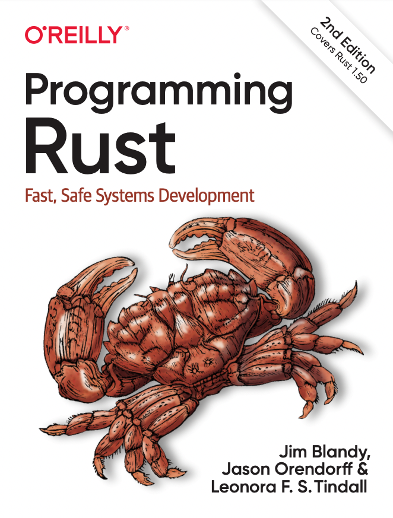
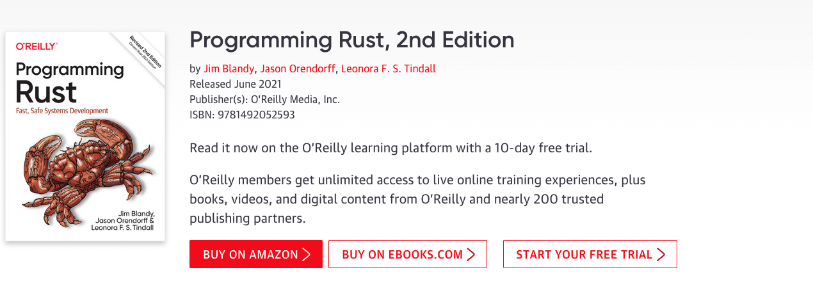

本文总结 `Rust` 编程中常用到的一些资料，集中做一个索引，以便查找。

<!--  -->

### 《Programming Rust, 2nd Edition》

这本书是 `O'Reilly` 出版社的，个人认为还是非常透彻的，作为初学者，对本书进行了学习和记录，内容大体上没有遗漏，只是对一些描述做了精简，[出版社书籍链接](https://www.oreilly.com/library/view/programming-rust-2nd/9781492052586/)。

正在重新校对中，表述有误的地方请评论或者提 `pr`，`✔️` 表示已校对。

1. [《第3章-Fundamental Types》（✔️）](/2022/04/10/【Rust】基础类型/)
2. [《第4章-Ownership and Moves》（✔️）](/2022/04/12/【Rust】所有权/)
3. [《第5章-References》](/2022/04/17/【Rust】引用/)
4. [《第6章-Expressions》](/2022/04/20/【Rust】表达式/)
5. [《第7章-Error Handling》](/2022/04/21/【Rust】错误处理/)
6. [《第8章-Crates and Modules》](/2022/04/22/【Rust】Crate-和-Module/)
7. [《第9章-Structs》](/2022/04/24/【Rust】结构体/)
8. [《第10章-Enums and Patterns》](/2022/04/25/【Rust】枚举和模式匹配/)
9. [《第11章-Traits and Generics》](/2022/04/26/【Rust】Trait和泛型/)
10. [《第12章-Operator Overloading》](/2022/04/28/【Rust】运算符重载/)
11. [《第13章-Utility Traits》](/2022/04/29/【Rust】常用-Trait/)
12. [《第14章-Closures》](/2022/04/30/【Rust】闭包/)
13. [《第15章-Iterators》](/2022/04/30/【Rust】迭代器/)
14. [《第16章-Collections》](/2022/05/01/【Rust】集合类型/)
15. [《第17章-Strings and Text》](/2022/05/01/【Rust】字符串和文本/)
16. [《第18章-Input and Output》](/2022/05/02/【Rust】输入输出/)
17. [《第19章-Concurrency》](/2022/05/03/【Rust】并发/)
18. [《第20章-Asynchronous Programming》](/2022/05/03/【Rust】异步编程/)
19. [《第21章-Macros》](/2022/05/04/【Rust】宏/)
20. [《第22章-Unsafe Code》](/2022/05/05/【Rust】Unsafe-代码/)
21. [《第23章-Foreign Functions》](/2022/05/06/Rust/Rust-ffi/)

### 其他内容

1. [Rust 生命周期](/2021/09/14/【Rust】生命周期/)
2. [Rust 学习笔记](/2021/09/05/【Rust】实战突破/)
3. [Rustup 介绍](/2022/04/07/【Rust】Rustup%20介绍/)
4. [Rust 交叉编译](/2022/04/08/【Rust】交叉编译/)
